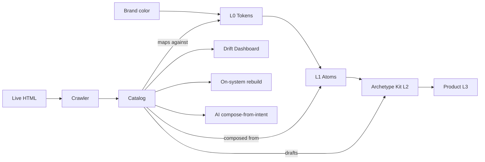

# 02 — Architecture

## The layer model

```
┌──────────────────────────────────────────────────────────────┐
│  L3 — Pages / compositions                                   │
│  Subjective. Owned by product designer. Never generalized.   │
├──────────────────────────────────────────────────────────────┤
│  L2 — Patterns (UserRow, StatTile, EmptyState, …)            │
│  Per-product. Some shipped in archetype kits as scaffolds.   │
│  Most live as RECIPES (docs + examples), not components.     │
├──────────────────────────────────────────────────────────────┤
│  Archetype Kit — opinionated L2 scaffold per product shape   │
│  Dashboard kit, Marketplace kit, Editorial kit, …            │
│  The "missing middle." Replaceable, not prescriptive.        │
├──────────────────────────────────────────────────────────────┤
│  L1 — Atoms (Button, Input, Avatar, Card, …)                 │
│  Universal. Fully tokenized. Framework-agnostic CSS.         │
├──────────────────────────────────────────────────────────────┤
│  L0 — Tokens (color, spacing, type, motion, …)               │
│  Universal physics. DTCG-compliant. Single source of truth.  │
└──────────────────────────────────────────────────────────────┘
```

**Generalization rule:**
L0 + L1 = universal (generalize aggressively).
Archetype Kit = generalize the *shape*, never the *content*.
L2 beyond the kit + L3 = subjective (never generalize).

## The four-stage system

```
    BRAND                PRODUCT TYPE            REAL PRODUCT
      │                       │                       │
      ▼                       ▼                       ▼
┌─────────────┐        ┌─────────────┐        ┌──────────────┐
│  L0 + L1    │───────▶│ Archetype   │───────▶│  Composed    │
│  branded    │        │ Kit applied │        │  product     │
│  to product │        │             │        │              │
└─────────────┘        └─────────────┘        └──────────────┘
      │                                              │
      │                                              ▼
      │                                       ┌──────────────┐
      └──────────────────────────────────────▶│  ARCHAEOLOGY │
                  measures fidelity            │  catalog +   │
                                               │  drift score │
                                               └──────────────┘
```

## The catalog — the product's real spec

For any given product, DTF produces:

```
catalog/
├── _meta.json                  product, version, crawl date
├── archetypes/                 ~100–150 distinct region types
│   ├── user-row/
│   │   ├── spec.yml            DTF-style component spec
│   │   ├── variants.json       discovered sub-variants
│   │   ├── states.json         default/hover/loading/error/etc
│   │   ├── evidence/           real screenshots from prod
│   │   ├── drift.json          per-property on/off-system score
│   │   └── on-system.html      DTF-native rebuild
│   └── …
├── routes/                     per-page archetype usage map
├── coverage/                   rollup metrics (by archetype, route, token)
└── timeline/                   drift over time (versioned crawls)
```

This catalog is the **substrate everything else stands on**: dashboards,
rebuilds, AI generation, audits, monitoring. Build the catalog right, all
downstream products fall out.

## How the layers connect



The **same DTF core** powers both the *definition* path (Brand → Product)
and the *measurement* path (Live → Catalog → Drift). They share L0 + L1 as the
common vocabulary.

## Key architectural decisions

| Decision | Why |
|---|---|
| Tokens are the source of truth, not Figma | Figma is a surface; the system must outlive any single tool |
| Components are CSS-first, framework wrappers thin | One implementation, many consumption modes |
| L2 patterns are mostly recipes, not components | Avoid the 200-brittle-component trap |
| Archetype kits are *per-product-shape*, not *per-company* | Bounded scope, infinite reuse |
| Catalog is the product spec, not the codebase | The codebase is one implementation of the catalog |
| Archaeology is continuous, not one-shot | Fidelity is a moving target |

## LLM cost model (clarification)

The pipeline is **mostly deterministic**, not LLM-heavy. Only 3 of 12 stages
touch an LLM, and they're carefully scoped.

| Stage | LLM? | Notes |
|---|---|---|
| Crawl, extract, segment, fingerprint (structural), cluster, token-map, drift-score | **No** | Pure code |
| Visual fingerprint per region | Embedding (CLIP) | ~$0.00002 / image |
| Semantic tag per region | Vision LLM (mini class) | ~$0.001 / region |
| L2 spec drafting | LLM (top tier) | Only for top ~100 clusters per product, **not per region** |
| Compose-from-intent (Figma plugin) | LLM (top tier) | Per designer request, ~$0.05 each |

### Cost per full archaeology crawl

Mid-size SaaS (50 routes × 4 states × 4 viewports ≈ 5,000 regions):

```
Embedding (5,000 × $0.00002)         $0.10
Vision tagging (5,000 × $0.001)      $5.00
Cluster spec drafting (100 × $0.02)  $2.00
Edge-case reruns                     $1.00
                                    ───────
Total per full crawl                 ~$8
```

### Cost for continuous monitoring

Most regions unchanged night-to-night → cached by fingerprint. Only 1–5% of
regions get re-processed per nightly run.
**~$0.10–$0.50 per nightly crawl. ~$15/month per customer.**

A $5,000/month customer = >99% gross margin on the LLM layer.

### Cost guardrails (baked into architecture)

| Risk | Mitigation |
|---|---|
| Per-region top-tier LLM calls | Cluster FIRST, then call LLM only on representatives |
| No caching | Embeddings + tags cached by region fingerprint |
| GPT-4 class for tagging | Use mini/haiku class; reserve top tier for spec drafting |
| Large products blow budget | Tier pricing by route count; pass-through above threshold |

**Conclusion:** LLM is <2% of total infra cost at scale. It's an enabler,
not a constraint. Engineering, browser compute, and storage dominate.

---

**Review:** `[ ]` keep · `[ ]` rework · `[ ]` expand · `[ ]` cut
