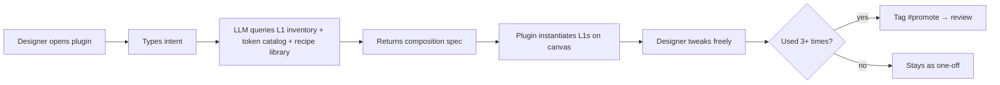

# Wireframe — Compose from Intent (Figma plugin)

**Goal:** Designer describes what they want, plugin instantiates real L1
components on canvas bound to real tokens. Editable Figma layers, not a
black-box export.

## Flow



## Plugin UI

```
┌──────────────────────────────────────────────┐
│  DTF — Compose from Intent              [×]  │
├──────────────────────────────────────────────┤
│  Describe what you want:                     │
│  ┌────────────────────────────────────────┐  │
│  │ Login form with email, password,       │  │
│  │ remember-me checkbox, submit button,   │  │
│  │ and a "forgot password" link.          │  │
│  │                                        │  │
│  └────────────────────────────────────────┘  │
│                                              │
│  Context (auto-detected):                    │
│   • Project: Acme Dashboard                  │
│   • Theme: brand-2024                        │
│   • Page: 📁 Auth flows                       │
│                                              │
│  Constraints:                                │
│   [x] Use only L1 atoms                      │
│   [x] Use project tokens                     │
│   [ ] Allow new L2 creation                  │
│                                              │
│              ▷ Cancel       ▶ Generate       │
└──────────────────────────────────────────────┘
```

## Preview before commit

```
┌──────────────────────────────────────────────────────────────┐
│  Composition Preview                                         │
├──────────────────────────────────────────────────────────────┤
│  ┌────────────────────────────────────┐                      │
│  │  Sign in to Acme                   │  ← Text (h2)         │
│  │                                    │                      │
│  │  Email                             │  ← Label (L1)        │
│  │  ┌────────────────────────────┐    │  ← Input (L1)        │
│  │  │                            │    │                      │
│  │  └────────────────────────────┘    │                      │
│  │                                    │                      │
│  │  Password                          │                      │
│  │  ┌────────────────────────────┐    │                      │
│  │  │                            │    │                      │
│  │  └────────────────────────────┘    │                      │
│  │                                    │                      │
│  │  [x] Remember me      Forgot? →    │  ← Checkbox + Link   │
│  │                                    │                      │
│  │  ┌────────────────────────────┐    │                      │
│  │  │     Sign in                │    │  ← Button (primary)  │
│  │  └────────────────────────────┘    │                      │
│  └────────────────────────────────────┘                      │
│                                                              │
│  Components used: Label×2, Input×2, Checkbox, Link,          │
│                   Button, Text                                │
│  Tokens used:     spacing-4, spacing-6, radius-md, …          │
│  Off-system:      0                                           │
│                                                              │
│  ▷ Regenerate    ▷ Edit prompt    ▶ Place on canvas          │
└──────────────────────────────────────────────────────────────┘
```

## After placement

Layers on Figma canvas are **real component instances**, not a flattened
image. Designer can:

- Swap variants via Figma's standard variant picker
- Override text, colors, sizes through normal Figma controls
- Detach if needed (but loses on-system guarantee)
- Add to a frame, group, or main component

## Where the catalog feeds back in

The LLM doesn't compose from generic UI knowledge. It composes from **this
project's actual catalog + recipe library**, so:

- If the project already has a `LoginForm` recipe → use it
- If similar patterns exist elsewhere in the catalog → reuse vocabulary
- If the project's tokens favor specific spacing rhythms → respect them

**Compose from intent gets smarter with every product DTF catalogs.** The
catalog isn't just a measurement artifact — it's training data for generation.

---

**Review:** `[ ]` keep · `[ ]` rework · `[ ]` expand · `[ ]` cut
