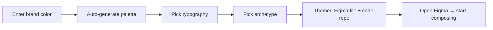

# Wireframe — Onboarding

**Goal:** Brand color in, working themed system + archetype scaffold out, in
under 30 minutes.

## Flow



## Step 1 — Brand

```
┌──────────────────────────────────────────────────────────────┐
│  DTF Onboard                                          1 of 4 │
├──────────────────────────────────────────────────────────────┤
│                                                              │
│   What's your brand color?                                   │
│                                                              │
│   [#________]   ◐ pick from image    ◑ pick from URL         │
│                                                              │
│   ┌───┬───┬───┬───┬───┬───┬───┬───┬───┬───┬───┐              │
│   │50 │100│200│300│400│500│600│700│800│900│950│ ← live ladder│
│   └───┴───┴───┴───┴───┴───┴───┴───┴───┴───┴───┘              │
│                                                              │
│   Anchor:  (•) Exact (your color = 500)                      │
│            ( ) Normalized (perceptually centered)            │
│                                                              │
│                                       ▷ Back    ▶ Continue   │
└──────────────────────────────────────────────────────────────┘
```

## Step 2 — Typography

```
┌──────────────────────────────────────────────────────────────┐
│  DTF Onboard                                          2 of 4 │
├──────────────────────────────────────────────────────────────┤
│   Pick a typography preset (or upload)                       │
│                                                              │
│   ┌───────────────┐ ┌───────────────┐ ┌───────────────┐      │
│   │ System modern │ │ Editorial     │ │ Geometric     │      │
│   │ Inter / Geist │ │ Source Serif  │ │ Manrope       │      │
│   │ [Preview Aa]  │ │ [Preview Aa]  │ │ [Preview Aa]  │      │
│   └───────────────┘ └───────────────┘ └───────────────┘      │
│                                                              │
│   ▷ Upload custom fonts                                      │
│                                       ▷ Back    ▶ Continue   │
└──────────────────────────────────────────────────────────────┘
```

## Step 3 — Archetype

```
┌──────────────────────────────────────────────────────────────┐
│  DTF Onboard                                          3 of 4 │
├──────────────────────────────────────────────────────────────┤
│   What kind of product are you building?                     │
│                                                              │
│   ┌────────────┐ ┌────────────┐ ┌────────────┐               │
│   │ Dashboard  │ │ Marketplace│ │ Editorial  │               │
│   │ [preview]  │ │ [preview]  │ │ [preview]  │               │
│   │ • Sidebar  │ │ • Search   │ │ • Article  │               │
│   │ • Stats    │ │ • Filters  │ │ • ToC      │               │
│   │ • Tables   │ │ • Cards    │ │ • Author   │               │
│   └────────────┘ └────────────┘ └────────────┘               │
│                                                              │
│   ┌────────────┐ ┌────────────┐ ┌────────────┐               │
│   │ Social     │ │ Editor     │ │ Workflow   │               │
│   │ [preview]  │ │ [preview]  │ │ [preview]  │               │
│   └────────────┘ └────────────┘ └────────────┘               │
│                                                              │
│   ▷ None of these (blank L1-only setup)                      │
│                                       ▷ Back    ▶ Continue   │
└──────────────────────────────────────────────────────────────┘
```

## Step 4 — Output

```
┌──────────────────────────────────────────────────────────────┐
│  DTF Onboard                                       Ready ✔   │
├──────────────────────────────────────────────────────────────┤
│   Your Dashboard kit for "Acme" is ready.                    │
│                                                              │
│   ▶ Open in Figma          (creates new file w/ kit applied) │
│   ▷ Download code repo     (pnpm package, tokens + L1 + L2)  │
│   ▷ Copy CLI command       (dtf init acme --archetype=...)   │
│                                                              │
│   What you got:                                              │
│   ✓  Branded token system (color, type, spacing, motion)     │
│   ✓  18 L1 atoms (Button, Input, Card, …)                    │
│   ✓  11 L2 patterns (Sidebar, StatTile, DataTable, …)        │
│   ✓  3 example pages (Overview, Users, Settings)             │
│   ✓  Recipe library (24 documented compositions)             │
│                                                              │
└──────────────────────────────────────────────────────────────┘
```

## Key decisions encoded

- Brand color is **the only required input** — everything else has defaults
- Archetype is **optional** (designer can skip → blank L1-only) but recommended
- Output is **Figma + code + CLI** simultaneously — no lock-in to one surface
- Example pages are **starter scaffolds**, not "the way it must look"

---

**Review:** `[ ]` keep · `[ ]` rework · `[ ]` expand · `[ ]` cut
