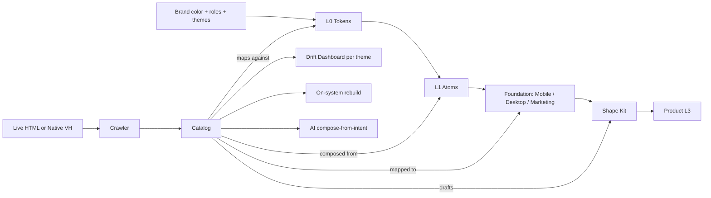

# 02 — Architecture (v0.2)

> **Delta from [v0.1](../v0.1-map/02-architecture.md):** Foundation tier added
> between L1 and shape-kits. Kit picker reframed as platform × product-shape.
> Catalog gains theme dimension. LLM cost model unchanged.

## The layer model

```
┌──────────────────────────────────────────────────────────────┐
│  L3 — Pages / compositions                                   │
│  Subjective. Owned by product designer. Never generalized.   │
├──────────────────────────────────────────────────────────────┤
│  L2 — Patterns (UserRow, StatTile, EmptyState, …)            │
│  Per-product. Some live in shape-kits; most as RECIPES.      │
├──────────────────────────────────────────────────────────────┤
│  Shape Kit — opinionated L2 deltas per product shape         │
│  e.g. mobile-writing (+4), mobile-commerce (+6),             │
│       desktop-dashboard (+11). Replaceable, not prescriptive.│
├──────────────────────────────────────────────────────────────┤
│  Foundation — platform-shape L2s shared across product shapes│
│  Mobile Foundation (10 L2s), Desktop Foundation, Marketing.  │
│  ← NEW TIER in v0.2 ←                                        │
├──────────────────────────────────────────────────────────────┤
│  L1 — Atoms (Button, Input, Avatar, Card, …)                 │
│  Universal. Fully tokenized. Framework-agnostic CSS.         │
├──────────────────────────────────────────────────────────────┤
│  L0 — Tokens (color, spacing, type, motion, …)               │
│  Universal physics. DTCG-compliant. Single source of truth.  │
└──────────────────────────────────────────────────────────────┘
```

### Why a Foundation tier exists

The two mobile-kit probes ([Writing](../v0.1-map/05-wireframes/probe-mobile-writing-kit.html),
[Commerce](../v0.1-map/05-wireframes/probe-mobile-commerce-kit.html)) showed
77% L2 overlap. That overlap is **platform-shape**, not product-shape:

- `AppShell.mobile`, `TopBar`, `BottomTabBar`, `SearchHeader`, `SwipeRow`,
  `ActionSheet`, `ConfirmSheet`, `SettingsRow.mobile`, `Toast.mobile`,
  `EmptyState.mobile`

These are concerns of *being a mobile app*, not of *being a writing app*. If
every shape-kit re-ships them, we pay 4× the maintenance cost. The Foundation
tier captures them once.

### Generalization rule (revised)

| Tier | Generalize? | Owned by |
|---|---|---|
| L0, L1 | aggressively — universal | DTF core |
| Foundation | aggressively — per platform | DTF core |
| Shape Kit | shape only, never content | DTF core (initial); shape teams (long term) |
| L2 beyond kit, L3 | never | product designer |

## The five-stage system

```
   BRAND          PRODUCT TYPE         PLATFORM × SHAPE         REAL PRODUCT
     │                  │                      │                      │
     ▼                  ▼                      ▼                      ▼
┌─────────┐      ┌──────────────┐     ┌─────────────────┐     ┌──────────────┐
│ L0+L1   │─────▶│  Foundation  │────▶│   Shape Kit     │────▶│  Composed    │
│ branded │      │  per platform│     │   (deltas only) │     │  product     │
└─────────┘      └──────────────┘     └─────────────────┘     └──────────────┘
     │                                                              │
     │                                                              ▼
     │                                                       ┌──────────────┐
     └──────────────────────────────────────────────────────▶│  ARCHAEOLOGY │
                                                              │  catalog +   │
                                                              │  drift score │
                                                              │  (per theme) │
                                                              └──────────────┘
```

## Build math — why Foundation is mandatory

Without a Foundation tier, 4 mobile kits cost:

```
4 kits × ~14 L2 patterns × ~4 states each = 216 component-states
```

With Foundation:

```
Mobile Foundation:      10 L2 × ~4 states = 40 states (paid once)
Writing kit delta:       4 L2 × ~4 states = 16 states
Commerce kit delta:      6 L2 × ~4 states = 24 states
Reading kit delta:       3 L2 × ~4 states = 12 states  (estimated)
Chat kit delta:          4 L2 × ~4 states = 16 states  (estimated)
                                            ───────────
Total:                                      108 states
```

**50% reduction. Foundation pays back after the 2nd shape-kit.**

The same math applies (estimated) to Desktop Foundation across Dashboard /
Marketplace / Editor / Workflow shapes. Marketing Foundation across Landing /
Docs / Blog. Validating these is open question Q21.

## The catalog — keyed by theme too

```
catalog/
├── _meta.json                  product, version, crawl date, themes
├── archetypes/                 ~100–150 distinct region types
│   ├── user-row/
│   │   ├── spec.yml
│   │   ├── variants.json
│   │   ├── states.json
│   │   ├── evidence/           per-theme screenshots from prod
│   │   │   ├── light/
│   │   │   └── dark/
│   │   ├── drift.json          per-property × per-theme drift
│   │   └── on-system.html
│   └── …
├── routes/
├── coverage/                   rollup × theme
└── timeline/
```

**v0.1 had a single drift score per region. v0.2 splits drift per theme.**
Real products like writer-handhelds ship light + dark with independent step
indices — a single score hides ~half the drift.

## Connection diagram



## Key architectural decisions (revised)

| Decision | Why | Status vs v0.1 |
|---|---|---|
| Tokens are the source of truth, not Figma | Figma is a surface | unchanged |
| Components are CSS-first, framework wrappers thin | One implementation, many consumption modes | unchanged |
| L2 patterns are mostly recipes, not components | Avoid the 200-brittle-component trap | unchanged |
| **Foundation per platform exists between L1 and shape-kits** | 77% overlap proven empirically | **new in v0.2** |
| **Shape kits ship only the delta over Foundation** | Cost amortizes; new kits get cheaper | **new in v0.2** |
| **Shape = platform × product-shape (not just product-shape)** | Writing-on-mobile ≠ writing-on-desktop | **new in v0.2** |
| Catalog is the product spec, not the codebase | Codebase is one implementation | unchanged |
| **Catalog keys drift on (archetype, state, viewport, theme)** | Themes diverge enough to need separate scoring | **new in v0.2** |
| Archaeology is continuous, not one-shot | Fidelity is a moving target | unchanged |
| **Archaeology has two evidence sources: web crawl + native VH** | Mobile apps have no DOM | **new in v0.2** |

## Foundation governance (new)

| Question | v0.2 answer |
|---|---|
| Who owns a Foundation? | DTF core, initially. Shape teams contribute via RFC. |
| What goes IN a Foundation? | L2 patterns used in ≥2 shape-kits AND stable across product-shape intents. |
| Promotion path | Shape-specific L2 → second use → RFC → Foundation candidate → reviewed → promoted on next minor. |
| Versioning | Foundation gets independent semver. Shape-kits pin to Foundation major (e.g. `mobile-writing@1.x` requires `mobile-foundation@^2`). |
| LTS | **Open — Q22.** Probably "shape-kits get N months to migrate after a Foundation major bump." |
| Cross-platform Foundations? | **Open — Q23.** Some primitives (Toast, Tooltip) may be cross-platform. To be tested. |

## Authoring discipline (new)

To avoid premature Foundation-ization, the rule is:

1. Build a new pattern **shape-specific first** (lives in the shape kit).
2. On second use in a different shape, **review for Foundation promotion**.
3. Don't pre-spec Foundations. The 10 mobile-Foundation patterns were
   *discovered*, not designed.

This mirrors the existing recipes→L2 promotion rule (Q7) one tier up.

## LLM cost model (unchanged)

See [v0.1 §LLM cost model](../v0.1-map/02-architecture.md#llm-cost-model-clarification).
Foundation tier doesn't change the catalog clustering cost — patterns still
cluster by visual + semantic fingerprint regardless of tier. The Foundation
mapping happens at spec-draft time, where a top-tier LLM call already exists.

---

**Review:** `[ ]` keep · `[ ]` rework · `[ ]` expand · `[ ]` cut
